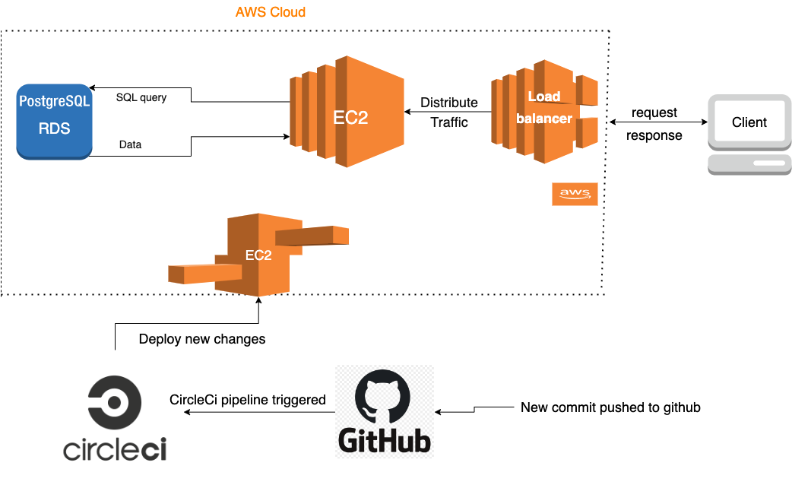
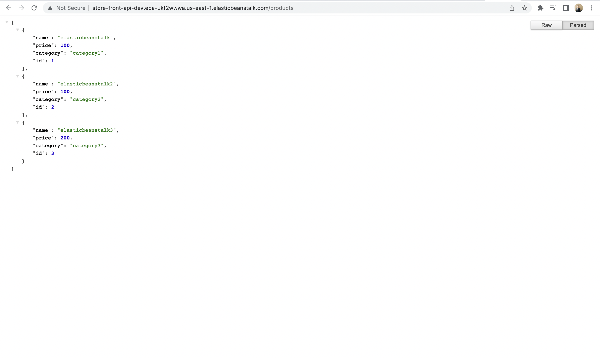

# Udacity Deployment Project
This project was used for storefron api application for udacity, now used as deployment project for udacity

## Application Diagram
This is the architecture of the application

## Application url 
This is url of backend app  **Elastic Beanstalk EC2**
[http://store-front-api-dev.eba-ukf2wwwa.us-east-1.elasticbeanstalk.com//](http://store-front-api-dev.eba-ukf2wwwa.us-east-1.elasticbeanstalk.com/)

## Deployment ScreenShots
The directory `deployment-images` contains screenshots of `aws resources` , `elastic beanstock` & `circleCi deployments`

## Scripts

- `npm run start ` serve www/server.js on elastic beanst
- `npm run build ` compile ts to js,create `www` folder that will be uploaded to ebs and zip its contents
- `npm run deploy ` deploys the www artifact to EBS
- `npm run jasmine ` run jasmine on dist folder
- `npm run test ` run build & jasmine scripts
- `npm run lint ` run linter
- `npm run prettier ` check prettier
- `npm run format:verify ` prettier verify format
- `npm run format ` write prettier format

# Resubmition 1
- [x] added filter to `config.yml` file that will trigger the build only when code pushed to main branch
- [ ] used `eb setenv` command to set EBS env variables
- [ ] documentation folder 
- [x] application diagram is `./deployment-images/app-diagram.png` 
- [x] A front end application is deployed using **S3 static website hosting**  on  [http://udacity-walkthrough8y77564.s3-website-us-east-1.amazonaws.com/](http://udacity-walkthrough8y77564.s3-website-us-east-1.amazonaws.com/)

