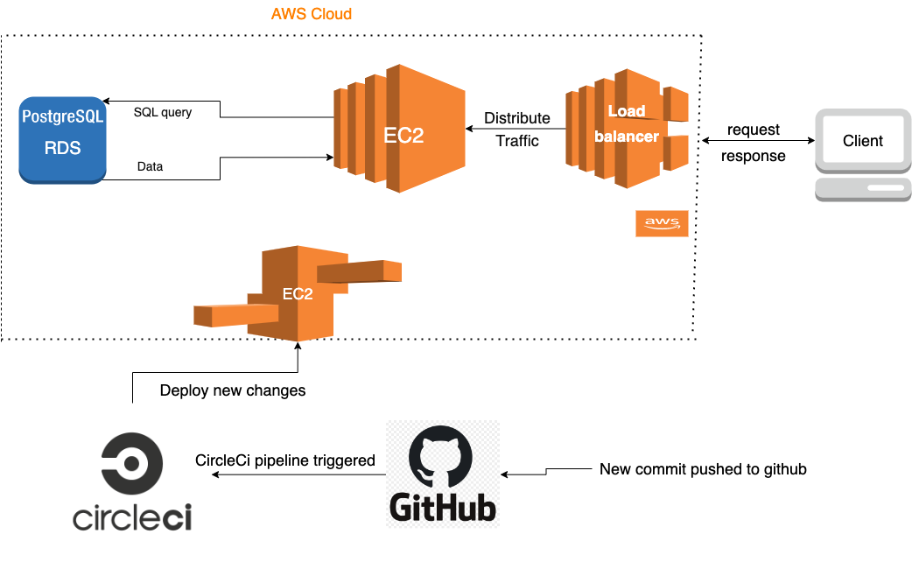

# The Infrastructure for this app includes 

## AWS RDS 
- Postgres database using AWS Relational Database Service

## AWS S3 
- Storage bucket to store a static frontend application

## AWS EBS
- Elastic Beanstalk to deploy the API application

## Infrastructure Diagram
This is the architecture of the application

